# DunHelm

> 面向多集群 Kubernetes 的容器云管理平台 —— 多集群接入、工作负载编排、DevOps 流水线与平台治理，一站式可视化管理。

DunHelm 是一个轻量级、自托管的 K8s 多集群管理控制台。它把「多集群接入」「资源可视化」「CI/CD 流水线」「镜像仓库」「平台治理（用户 / 角色 / 审计）」整合到一个冷蓝科技风的统一界面里，后端通过 client-go 直连真实集群，前端实时展示集群真实状态。

---

## 一、平台功能

DunHelm 围绕「**多集群 + 真实数据 + 平台治理**」设计，主要功能模块如下：

### 1. 集群管理（多集群接入）
- 注册 / 删除多个 Kubernetes 集群，粘贴 KubeConfig 文本即可接入。
- 后端实时探测集群连通性（ready / 待配置 / 格式错误 / 不可达），探测结果写回状态。
- 统一集群选择器，按 `?cluster=<id>` 切换当前操作的集群，未选集群时回退演示数据。

### 2. 资源总览与运维
- **集群总览**：CPU / 内存水位、节点健康、命名空间、事件趋势等 KPI。
- **工作负载**：Deployment / StatefulSet / DaemonSet / Job / CronJob 的列表、详情、YAML 与运行时操作（暂停 / 重启 / 滚动升级 / 回滚）。
- **集群节点**：节点列表、资源水位、节点上的 Pod 分布。
- **存储卷**：StorageClass / PV / PVC 管理、容量配额与状态。
- **网络与存储**：Service / Ingress / NetworkPolicy 的创建、编辑与删除。
- **配置 ConfigMap**：集群 ConfigMap 浏览与覆盖。

### 3. DevOps 持续交付（按集群隔离）
- **流水线**：自研 DAG 编排引擎，支持 git / 源码 / 镜像等多种源节点，以及 build / docker-build / test / push / deploy / notify / wait / custom 等阶段。
- **构建记录**：每次流水线运行的构建历史、阶段日志与控制台输出。
- **镜像仓库**：多注册中心接入（Harbor 可建仓，DockerHub / ACR 只读），三级联动选择镜像 tag。
- **构建配置**：平台级 / 集群级 Maven 全局配置（settings.xml mirror / proxy）。

### 4. 平台治理
- **企业空间（多租户）**：工作空间隔离与资源配额。
- **用户与角色（RBAC）**：平台管理员 / 空间管理员 / 开发者 / 访客 四类系统角色，支持邀请用户、重置密码、启用 / 禁用；用户-集群权限分配与菜单可见性控制。
- **审计日志**：全量操作审计、敏感操作标记、多维筛选与 CSV / JSON 导出。
- **代码凭证**：Git / 镜像仓库 / SSH / KubeConfig 等凭据的集中加密管理。
- **应用商店**：官方与社区应用模板一键部署。

### 5. 安全与体验
- JWT 鉴权 + 路由守卫，未登录不可访问。
- 密码 bcrypt 哈希存储，绝不返回前端。
- 集群状态点实时反映真实连通性，无权限时自动清空展示数据（不显示预制 mock）。

---

## 二、平台架构

DunHelm 采用前后端分离、单仓库（mono-repo）结构：

```
┌─────────────────────────┐         ┌──────────────────────────────────────┐
│   Web 前端 (React SPA)   │   /api  │            Go 后端 (Gin)             │
│  React 19 + TS + Vite   │────────▶│  Handler → Service → Repository      │
│  Tailwind + recharts    │  proxy  │  ├─ 多集群管理 / RBAC / 审计         │
└─────────────────────────┘         │  ├─ client-go 直连真实 K8s 集群      │
                                     │  ├─ 自研 CI 引擎 (DAG 流水线)        │
                                     │  └─ GORM + SQLite(默认)/MySQL(可选)  │
                                     └───────────┬──────────────────────────┘
                                                 │ client-go / kubectl
                                         ┌───────┴────────┐
                                         │  K8s 集群 A / B │ ...
                                         └────────────────┘
```

- **前端**：纯静态 SPA，开发态由 Vite 把 `/api` 代理到后端 `:8088`。
- **后端**：Go + Gin，RESTful API；通过 `client-go` 解析 KubeConfig 并操作目标集群；多集群通过 `?cluster=<id>` 隔离。
- **数据层**：默认 SQLite（零依赖、单文件），生产可切换 MySQL（`DB_DRIVER=mysql`）。
- **CI 引擎**：后端内置 DAG 执行器，可临时拉起构建 Pod、执行命令、推送镜像并真实部署。

---

## 系统截图

> 以下截图均来自真实运行的 DunHelm 实例（管理员视角），覆盖从登录、集群总览到 DevOps 与平台治理的主要界面。

| 登录页 | 集群总览 |
| --- | --- |
| 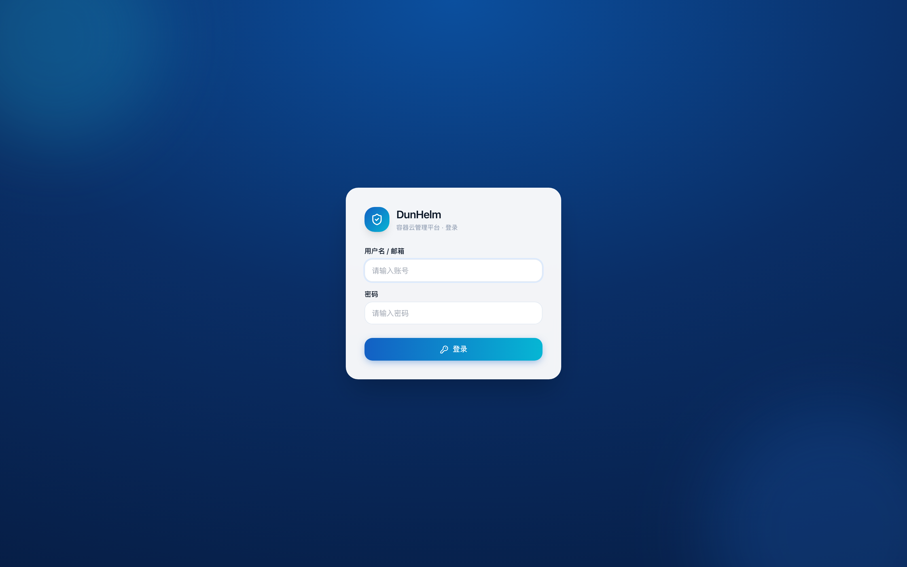 | 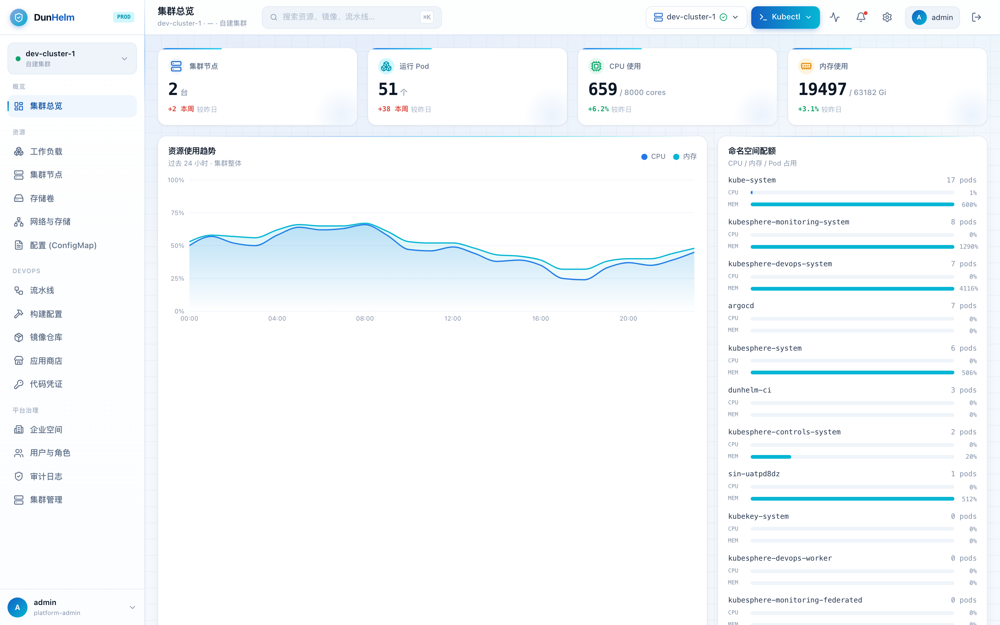 |

| 工作负载 | 集群节点 |
| --- | --- |
| 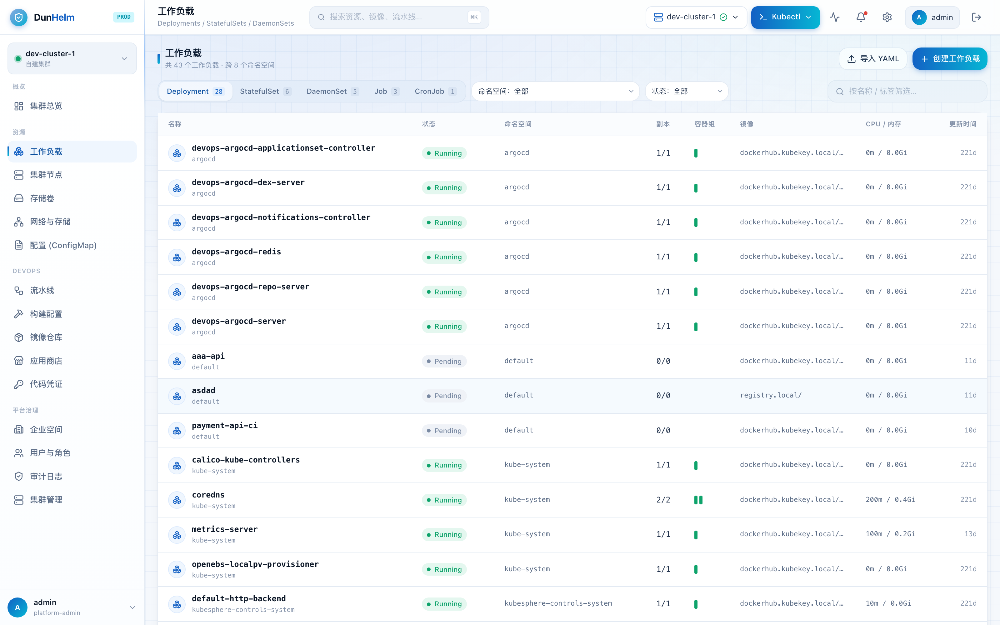 | 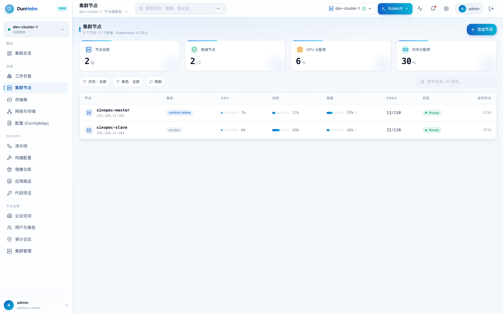 |

| 存储卷 | 网络 |
| --- | --- |
| 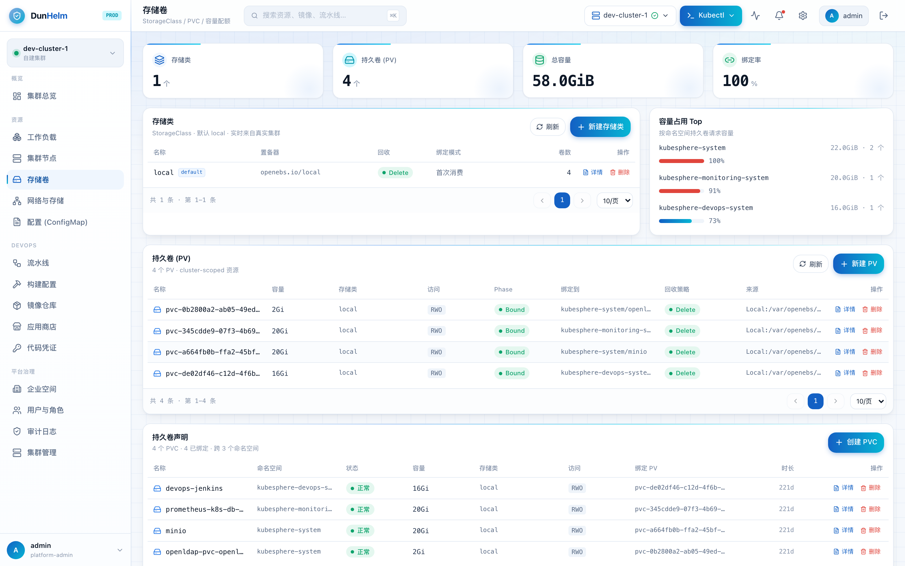 | 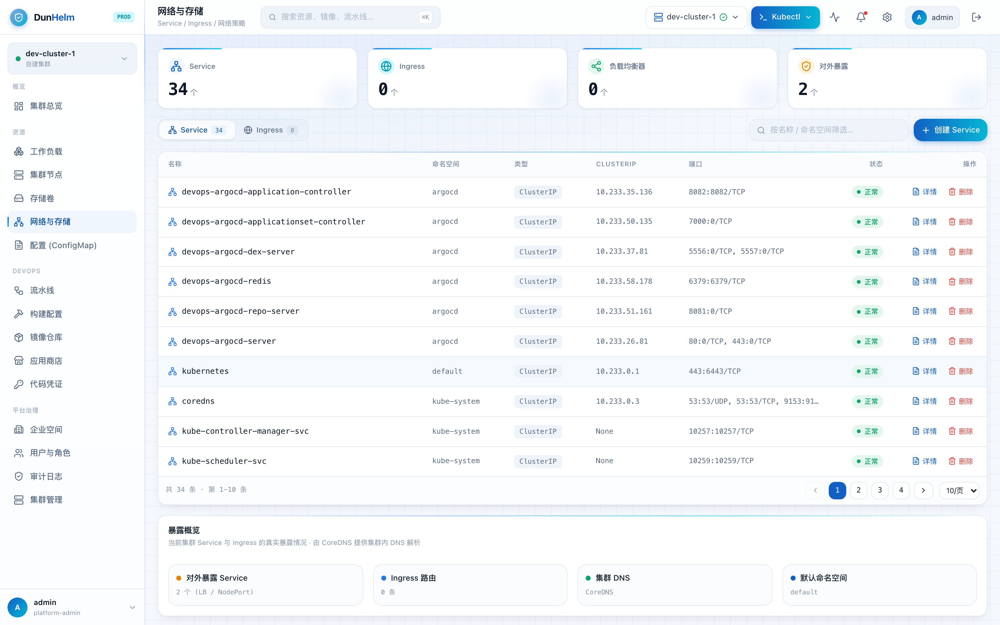 |

| 配置 (ConfigMap) | 流水线 |
| --- | --- |
| 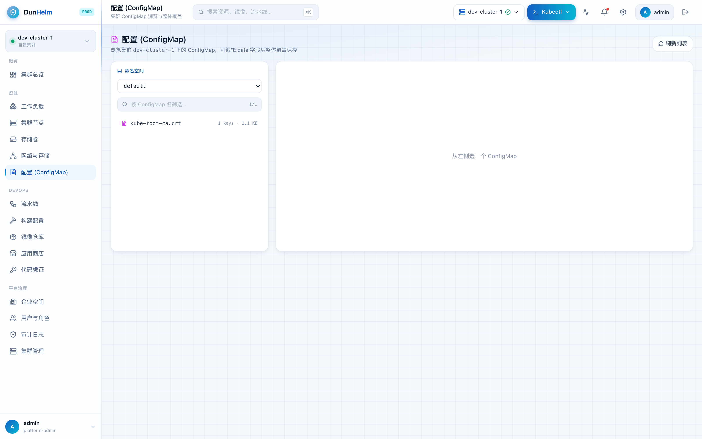 | 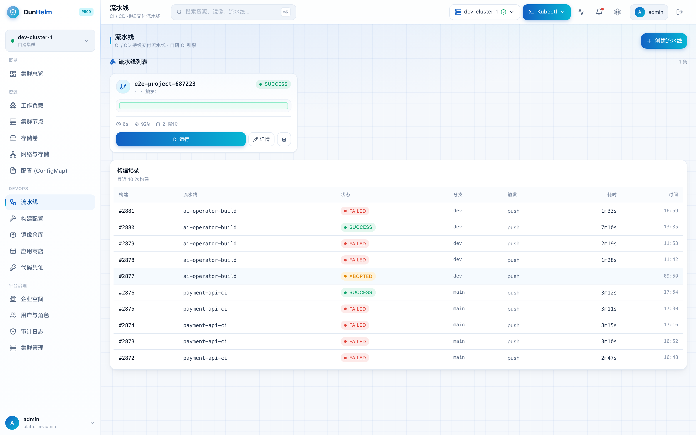 |

| 构建配置 | 镜像仓库 |
| --- | --- |
| 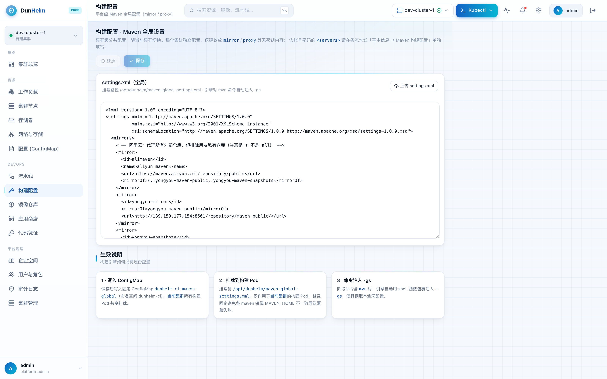 | 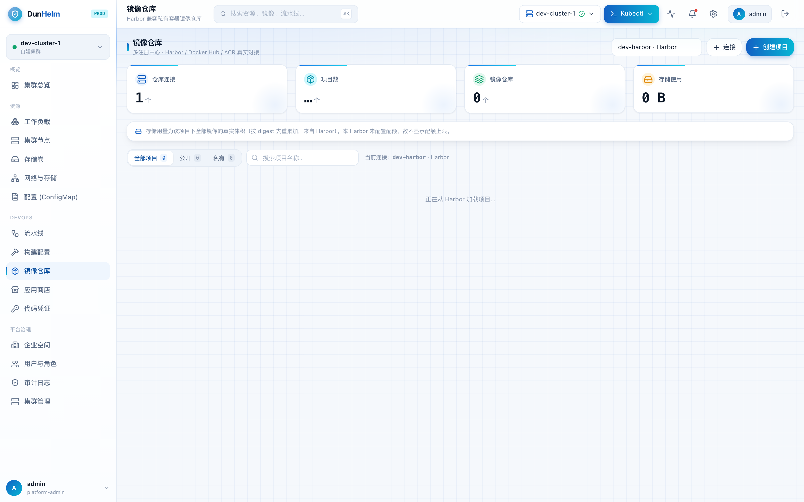 |

| 应用商店 | 代码凭证 |
| --- | --- |
| 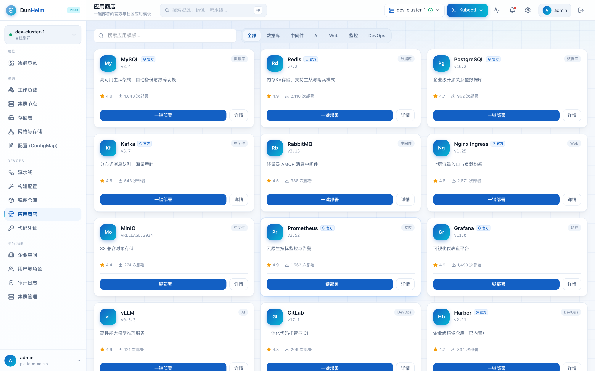 | 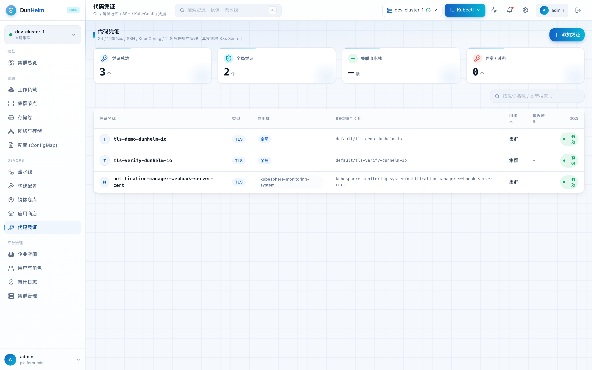 |

| 企业空间 | 用户与角色 |
| --- | --- |
| 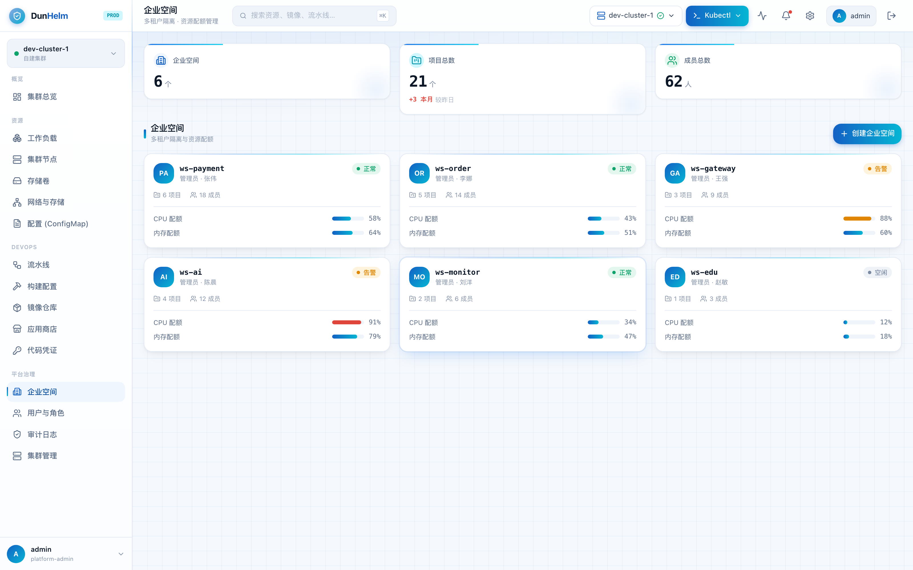 | 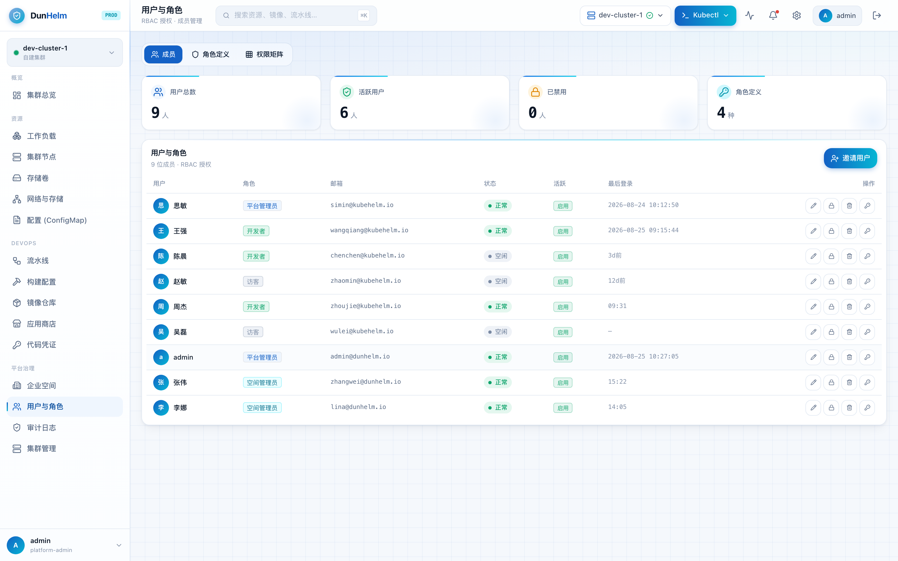 |

| 审计日志 | 集群管理 |
| --- | --- |
| 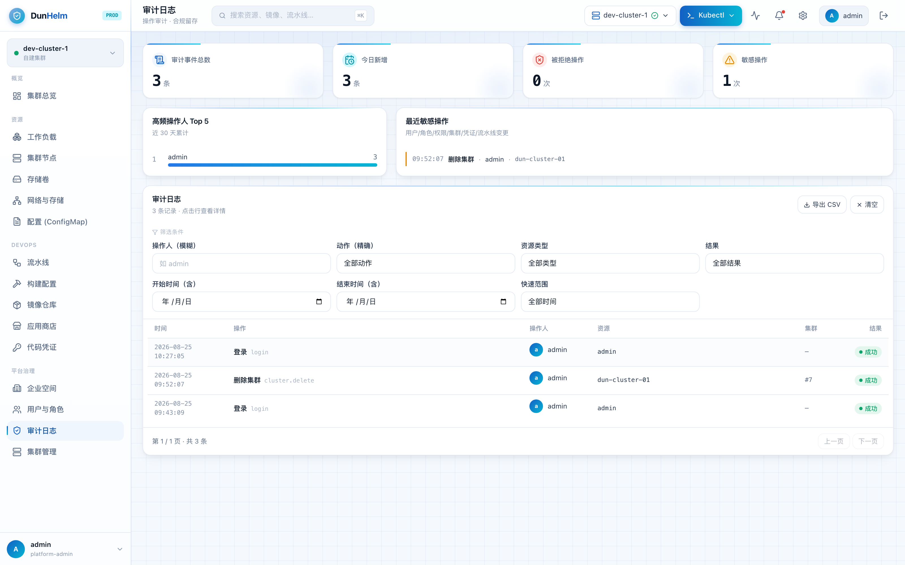 | 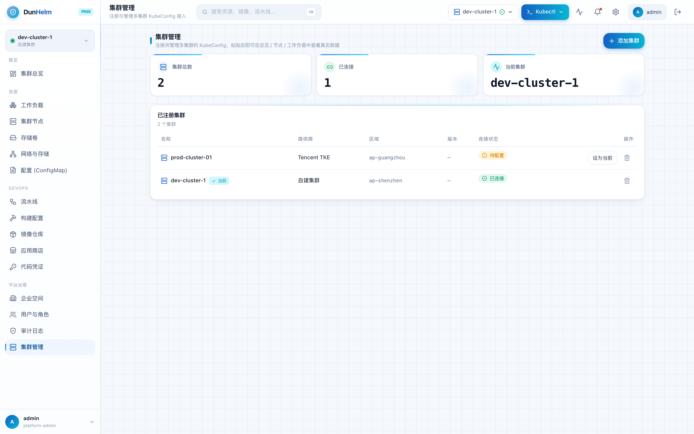 |

---

## 三、技术栈

| 层 | 技术 |
|----|------|
| 前端框架 | React 19 + TypeScript + Vite 7 |
| 前端 UI | Tailwind CSS 3、Radix UI、lucide-react、recharts（图表） |
| 前端工程 | ESLint 9、TypeScript 5.9 |
| 后端语言 | Go 1.25+ |
| 后端框架 | Gin、GORM、golang-jwt |
| 数据库 | SQLite（glebarez/sqlite，纯 Go 无 CGO）/ MySQL（可选） |
| K8s 对接 | client-go / metrics（k8s.io v0.36） |
| 鉴权 | JWT + bcrypt 密码哈希 |
| 部署 | 单体二进制 + 静态前端，支持 Docker / 二进制 / systemd(launchd) |

---

## 四、目录结构

```
DunHelm/
├── app/                     # 前端（React + Vite）
│   ├── src/
│   │   ├── pages/           # 各功能页面（总览/工作负载/流水线/用户/审计…）
│   │   ├── components/      # 布局与业务组件（Sidebar/Topbar/primitives…）
│   │   ├── data/            # 数据 Hook（useLive 等，含 mock 兜底）
│   │   └── lib/             # API 客户端、鉴权、集群状态本地缓存
│   ├── package.json
│   └── vite.config.ts
├── server/                  # 后端（Go + Gin）
│   ├── main.go              # 入口：配置/迁移/路由/bootstrap
│   ├── internal/
│   │   ├── handler/         # HTTP 处理层
│   │   ├── router/          # 路由注册
│   │   ├── repository/      # 数据访问层
│   │   ├── model/           # GORM 模型
│   │   ├── ci/              # 自研 CI 引擎（DAG 执行）
│   │   ├── k8s/             # client-go 封装
│   │   ├── crypto/          # bcrypt 密码哈希
│   │   ├── seed/            # 内置用户 / 角色初始化
│   │   └── middleware/      # 鉴权 / 集群权限中间件
│   ├── go.mod
│   └── manifests/           # node-exporter / metrics-server 等部署清单
├── kubehelm.db              # 运行时数据库（默认 SQLite，已被 .gitignore 忽略）
└── README.md
```

---

## 五、本地开发

### 环境要求
- Node.js 20+（推荐 22）
- Go 1.25+
- 可选：一个可用的 Kubernetes 集群（用于对接真实数据）；无集群时前端回退演示数据

### 1. 启动后端（端口 8088）

```bash
cd server

# 编译（注意：请勿使用 `go run .`，子进程在部分环境下会被回收）
go build -o kubehelm-server .

# 启动（默认端口 8088；本地联调建议关闭代理以避免 127.0.0.1 走代理）
PORT=8088 no_proxy=127.0.0.1,localhost ./kubehelm-server
```

> 后端启动时会自动完成数据库迁移、内置角色 / 用户 seed、旧数据迁移等初始化工作。

### 2. 启动前端（端口 5173）

```bash
cd app
npm install
npm run dev
# 或：node node_modules/vite/bin/vite.js --host 0.0.0.0 --port 5173
```

浏览器访问 `http://localhost:5173` 即可。前端 Vite 已配置把 `/api` 代理到 `http://127.0.0.1:8088`。

### 3. 默认管理员账号

| 字段 | 值 |
|------|----|
| 用户名 | `admin` |
| 密码 | `DunHelm@2026` |
| 角色 | platform-admin |

> 首次登录后请尽快在「用户与角色」中修改默认密码。所有内置用户初始密码均为此值。

---

## 六、构建与部署

### 前端构建

```bash
cd app
npm install
npm run build          # 产物输出到 app/dist
```

`dist/` 为静态资源，可由任意静态服务器（Nginx / Caddy / 对象存储 / CDN）托管。

### 后端构建与运行

```bash
cd server
go build -o kubehelm-server .
PORT=8088 \
DB_DRIVER=sqlite \
DB_DSN=kubehelm.db \
JWT_SECRET=<请替换为强随机串> \
./kubehelm-server
```

生产环境建议使用 MySQL：

```bash
DB_DRIVER=mysql \
DB_DSN='user:password@tcp(127.0.0.1:3306)/dunhelm?charset=utf8mb4&parseTime=True' \
./kubehelm-server
```

### 通过反向代理对外暴露（示例）

将前端静态资源由 Nginx 托管，并把 `/api` 反向代理到后端 `:8088` 即可：

```nginx
location /api/ {
    proxy_pass http://127.0.0.1:8088/;
    proxy_set_header Host $host;
    proxy_set_header X-Real-IP $remote_addr;
}
```

### 后台驻留

- macOS：可使用 `launchd` 配置 plist 守护（`server/` 下提供 `com.kubehelm.server.plist` 参考）。
- Linux：使用 `systemd` 单元或 `nohup ./kubehelm-server &`。

---

## 七、环境变量

| 变量 | 默认值 | 说明 |
|------|--------|------|
| `PORT` | `8088` | 后端监听端口 |
| `DB_DRIVER` | `sqlite` | 数据库驱动：`sqlite` 或 `mysql` |
| `DB_DSN` | `kubehelm.db` | SQLite 文件路径 / MySQL DSN |
| `JWT_SECRET` | `kubehelm-dev-secret-change-in-prod` | JWT 签名密钥（**生产务必修改**） |
| `FRONTEND_URL` | `http://127.0.0.1:5173` | CORS 允许的前端来源 |

---

## 八、许可证

本项目为开源项目，详见仓库 LICENSE（如有）。
